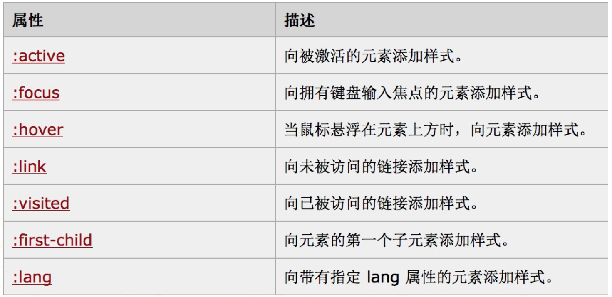
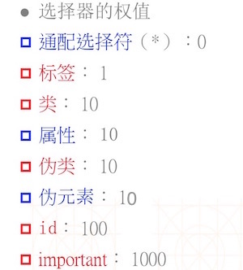

# CSS学习笔记

## 一、CSS选择器

### 0.通配符
通配符是全局的设定的CSS样式，也就是设置了之后整个界面都会采用的样式。

```html
<style>
	*{color: red;}
</sytle>

<body>
	<div>我是div</div>
</body>

```

### 1.标签选择器

标签选择器就是选择html对应的标签名字，然后设定CSS样式。

```html

<style> 

	div {
		color : red
	}

</style>

<body>

	<div>我是div标签</div>

</body>

```

这就是一个典型的标签选择器，在style中设置div的标签的CSS样式。

### 2.类选择器

类选择器就是设置一个类名，然后通过.类名来进行设置。

```html

<style>

  .high {
    color: red;
  }

</style>

<body>

  <div class="high">我是div标签2</div>

</body>

```

class里面输入的是类名，使用类选择器，要使用.跟上类名来定义这个类CSS。

### 3.id选择器

id选择器就是使用id=""来定义，但是设置CSS那边，要使用#来进行标记。

**id选择器只能有一个，如果设置多个，就会无法使用**

```html

<style>

  #test {

    color: red;

  }

</style>

<body>

  <div id="test">我是div标签2</div>

</body>

```

### 4.并联选择器

并联选择器顾名思义就是或选择器，中间用，号进行隔开，表示只要满足相关的，都采用下面的CSS的样式。

```html

<style>

  div, .high {

    color: red;

  }

</style>

<body>

  <div>我是div标签1</div>

  <div class="high">我是div标签2</div>

  <p>我是段落标签</p>

</body>

```

这边代码意思是只要是div标签或者是high类的都会执行相应的css样式。

### 5.复合选择器

复合选择相当于与运算，只有同时满足这2个条件，才会添加CSS样式。

```html

<style>

  div.high {

    background-color: green

  }

</style>

<body>

  <div>我是div标签1</div>

  <div class="high">我是div标签2</div>

  <p>我是段落标签</p>

</body>

```

这段代码意思就是满足是div标签，同时满足class为high才会添加背景颜色这个CSS样式。

### 6.后台选择器

后代选择器的意思就是一个标签里面包含的其他标签就会采用这种CSS样式。用空格来划分。

```html

<style>

  div p {

    background-color: blue;

  }

</style>

<body>

    <div>

        <p>我是div标签里面的p标签1</p>

        <span>

            <p>我是div标签里面的span标签里面的P标签</p>

        </span>

    </div>

</body>

```

这段代码的意思是div标签里面的p标签就要采用CSS的样式。

### 7.直接继承标签

所谓的直接继承就是父与子的关系， 比方说div标签里面有一个p标签，那这个p标签就是div标签的直接继承标签，如果div标签里面有一个span标签，span标签里面有一个p标签，那么就不符合直接继承的关系。直接继承标签用>来连接

**注意：如果div标签里面包含一个div标签，里面的div标签包含一个p标签，那么也满足直接继承关系**

```html

<style>

  div > p {
    background-color: blue;
  }

</style>

<body>

      <div>
      
        <p>我是div标签里面的p标签1</p>
        
        <span>
            <p>我是div标签里面的span标签里面的P标签</p>
        </span>

        <div>我是div标签2
            <p>我是p标签2</p>
        </div>

    </div>

</body>

```

### 8.相邻兄弟选择器

所谓的相邻兄弟选择器XX+YY，用+号来表示,表示与XX相邻的YY所使用的CSS样式。

**注意点：如果XX里面包含YY则不会触发，YY无论是在XX上面还是XX下面都是相邻**

```html

<style>

  div + span {
    border: 10px groove red;
  }

</style>

<body>

    <span>我是div的兄弟span</span>

    <div>我是div</div>

    <span>我是div的兄弟span</span>

    <p>我是span的兄弟p</p>

</body>

```

### 9.属性选择器

所谓的属性选择器，就是在标签中添加属性，通过属性来定位到该标签设置CSS的样式。

```css

<style>

  span[name] {
    font-size: 40px;
  }
  
  span[name][age] {
    color: red;
  }

  span [name="YY"] {
    background-color: yellow;
   }

</style>

<body>

	<span name="xx">我是属性选择器的span1</span><br>

	<span name="xx" age="20">我是属性选择器span2</span>

	<span name="YY">我是属性选择span3</span>

</body>

```

### 10.伪类和伪元素

伪类和伪元素就是指在特定的事件触发的时候，调用的CSS的样式，用:号来表示。



伪元素和伪类一样：


```css

<style>

  input:focus {

    outline: none;

    width: 500px;

    height: 300px;
    
   }

</style>

<body>
  <input placeholder="请输入">
</body>

```

### 11.importtant

important的在任何选择器中使用!important进行标记，然后强制使用该css样式。

```markup
 <style>
	*{
	    color: blue !important;
	    font-size: 40px;
	}
	
	div{
	    color: red;
	    font-size: 20px;
	}
</style>

<body>
	<div>你好,世界</div>
</body>

```
本来采用的CSS样式应该是div的css，但是因为上面color被important修饰了，因此颜色是红色。


## 二、CSS选择器的优先级

**==选择器的针对性越强，优先级越高==**

有关CSS选择器的优先级，这里需要知道权值这个概念，权值越高，优先级越高。

<div align="center">    
	
</div>

**==选择器的权值进行相加，越大的越优先，如果权值相同，则使用就近原则。==**

==优先级排序：
important > 行内css > id > 类 | 伪类 | 属性选择 | 伪元素 > 通配符 > 继承==


## 三、HTML标签的类型

HTML的标签分为3种类型：

1. 块级标签：
	* 独占一行；
	* 可以改变宽度和高度；
2. 行内标签
	* 多个标签能同时显示在同一行，不能改变宽度和高度；
3. 行内-块级标签
	* 多个标签能同时显示在同一行；
	* 可以改变宽度和高度

为了满足开发需要，提供了一个属性来随时更改标签的类型->display,这个属性有3个值：block -> 块级标签，inline -> 行内标签，inline-block -> 行内-块级标签，none -> 隐藏标签。

通过设置display的值，可以随时改变标签类型，满足开发的需要。

## 四、CSS属性

### 1.CSS属性可继承和不可继承

CSS的属性分为可以继承和不可继承。继承就是父类标签的属性传递给子类属性，通常文字控制类的属性可以传递，区块控制的属性不可传递。

* 可继承属性：

```html
<style>
	body{
		color: red;
		font-size: 40px;
	}
</style>

<body>
	<div>我是div标签</div>
	<p>  我是p标签</p>
</body>
```
设置body的CSS样式，div和p都是继承自body，因此颜色和文字大小都得到了改变。

* 不可继承属性：

```html
<style>

	#main{
		background-color: red;
		width: 500px;
		height: 100px
	}
	
	.inline{
		background-color: green;
		width: 100px;
	}
	
</style>

<body>

	<div id="main">
		<div class="inline">我是内部的div标签</div>
	</div>
	
</body>

```
main里面的属性因为属于块控制的属性，因此没法继承给下面div标签。


