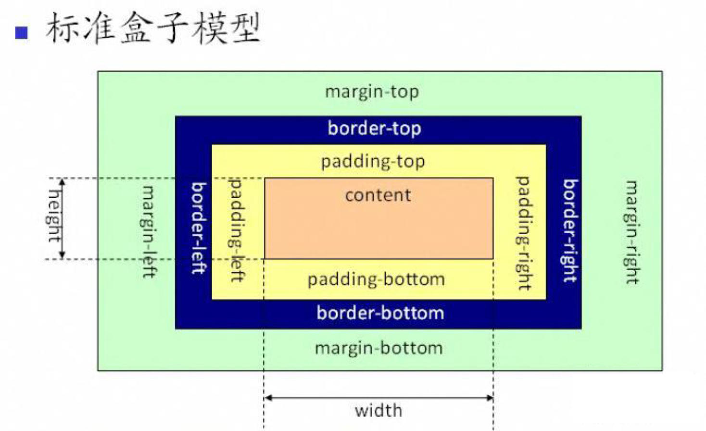
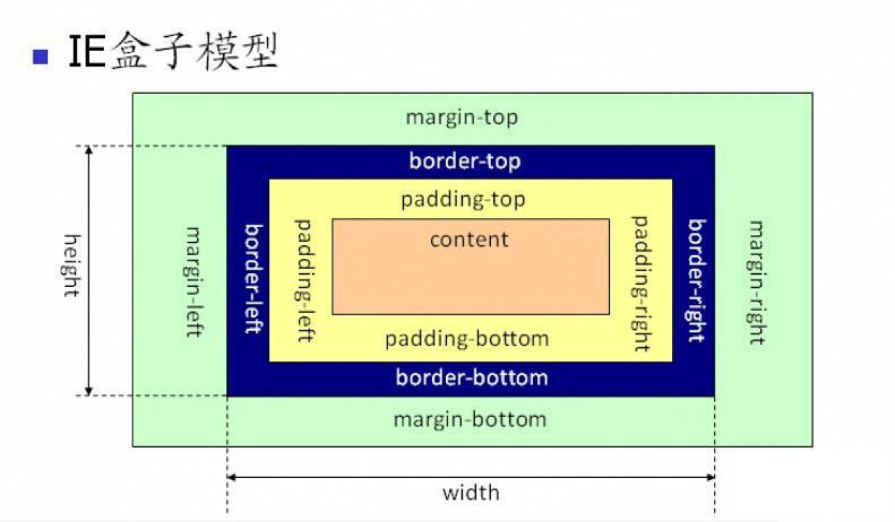
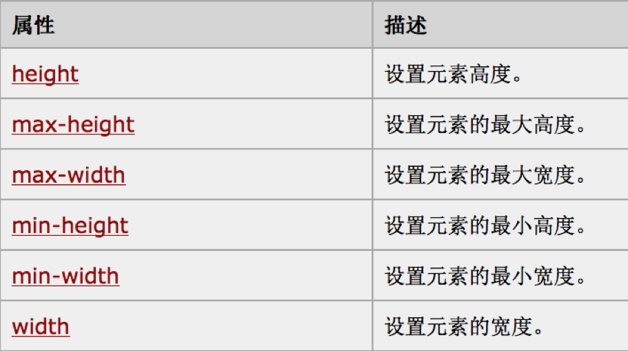
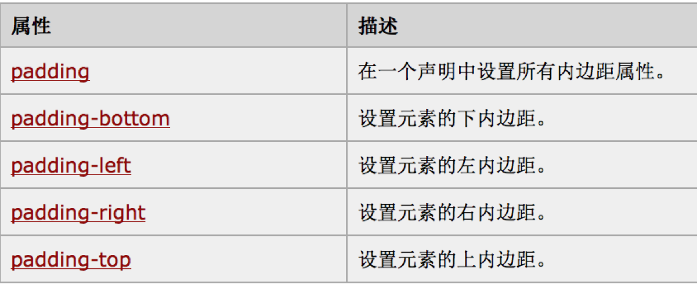
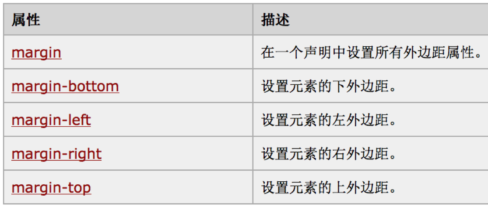

# 盒子模型

## 盒子模型的总结

HTML的每个标签可以理解为一个盒子模型。

盒子模型组成：

1. content 内容：用来显示标签里面具体内容。
2. padding 内边距：可以理解为盒子里面装的塑料架子，和iOS中的contentInset类似。
3. border 边框：盒子本身，可以设置样式，颜色和大小。
4. margin 外边距：每个盒子之间的距离。

## 盒子模型的种类

盒子模型分为2中，一种是国际化组织设定的，还有一种是微软自己搞的，导致浏览器适配是前端一件非常头疼的事情，就是因为不统一标准。

### 标准盒子模型



这是国际标准化组织设定的标准的盒子模型。

### IE盒子模型



这是微软自己设定的盒子模型。

### 区别

通过对比两张图可以发现大部分设定都是一样的，区别就是标准盒子模型的宽度和高度是根据内容的大小决定的，但是IE盒子模型的宽度和高度是根据内容+pading+border来确定的，这样会导致浏览器显示不兼容。

## 盒子的属性

### 1.内容属性



### 2.内边距属性



这里的设置这个属性相关的有4中写法：

#### 方式一、

> 1.padding: 10px 5px 15px 20px;

* 上边距10px
* 右边距5px
* 下边距15px
* 左边距20px

#### 方式二、

> 2.padding: 10px 5px 15px;

* 上边距10px
* 左右边距5px
* 下边距15px

#### 方式三、

> 3.padding: 10px 5px

* 上下边距10px
* 左右边距5px

#### 方式四、

> 4.padding: 10px

* 上下左右边距都是5px

### 3.border属性

边框简写属性可以在一个申明中设置所有的边框属性，可以按照如下的顺序设置：

* border-width
* border-style
* border-color

如下：

```markdown
<style>
	p{border: 5px solid red;}
</style>
```
### 4.margin属性



使用方法和内边距类似。


