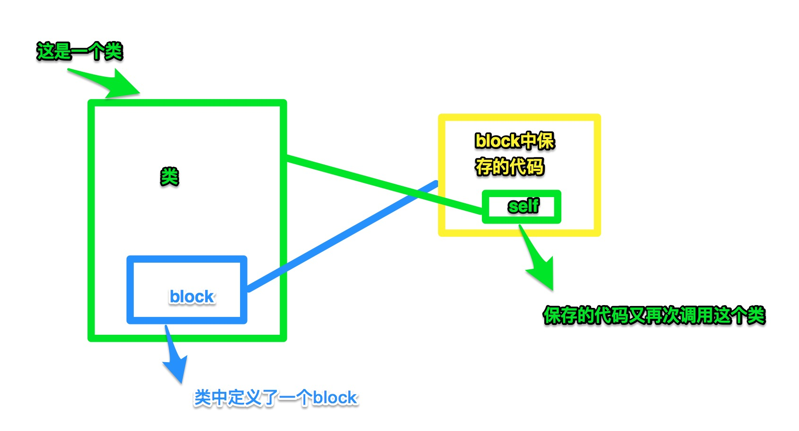
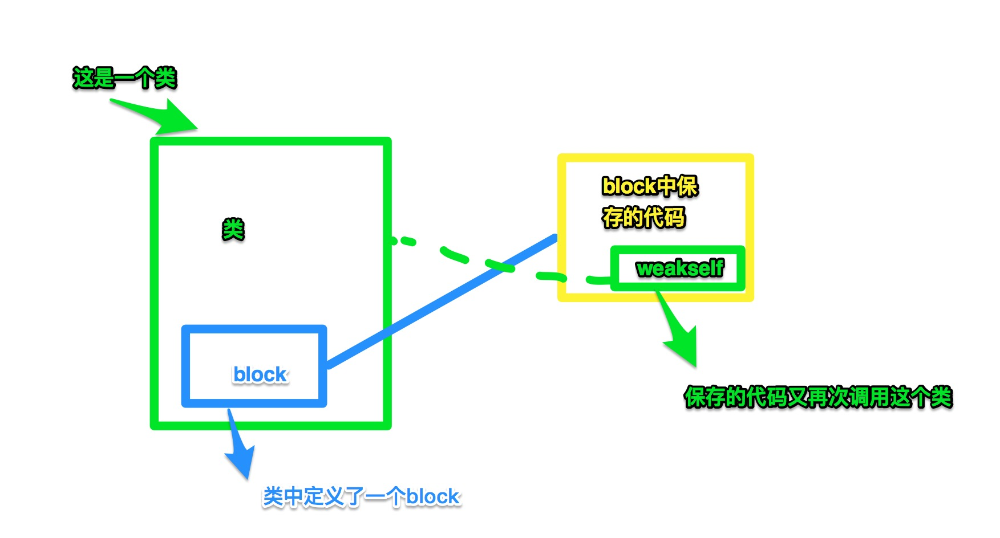

# block深入学习

## 一、初识block

### 1. block作用

block的作用就是保存一段代码。

### 2. block写法

#### 2.1 block申明

返回值(^名字)(参数类型)，这就是block的申明。

```obj-c
void(^home)()
```
这个就是申明一个经典的block，无返回值类型，无参数，名字叫home的block。

#### 2.2 block的定义

##### 第一种写法

```obj-c
void(^home)() = ^() {

};
```
这是最标准的写法。

##### 第二种写法

* 如果没有参数，可以吧()省略：

```swift
void(^home)() = ^ {

};
```
* 如果有参数，定义的时候必须要写参数，而且必须要带上参数名：

```swift
void(^home)(NSString *) = ^(NSString * value) {

};
```

##### 第三种写法

block的返回值可以省略不写，不管有没有返回值都可以省略：

```swift
int(^home)() = ^int {

}

int(^home2)() = ^ {

};
```
这两种写法都是可以的，通常省略不写。

### 3. block的类型

block作为参数传递的时候需要把block类型传递过去，而block类型是这么写的：

返回值(^)(参数类型)

```swift
void(^)()
int(^)(NSString *)
```
如上，第一个是无返回值无参数的block类型，第二个是返回int，参数是字符串的block类型。

同时也可以使用typedef来对block类型进行命名：

```obj-c
typedef void(^block)();
```

**如上这里的意思对void(^)()这个block类型进行重命名，名字为block，而不是申明一个block，这点要注意！**

### 4. block调用
block的调用很简单，就是block的名字接参数，注意如果是没有参数的block，也需要把（）带上！

```obj-c
home();
```

**上面就是调用一个没有参数的home的block，同时因为block不一定有值,因此要先做一个判断，如果有这个block，才调用，不然会出错！**

## 二、block具体使用

在开发中大部分情况下需要把block设置成属性，这里有2种方案：

**方案一：**

```obj-c
@property (nonatomic, readwrite, strong) void(^callBack)();
```
**注意点：block设置属性的时候怎么申明一个block，就怎么写。关于为什么这里用strong而不是copy，在下面进行讲解。**

**方案二：**

```obj-c
typedef void(^callBack)(NSString *);

@interface BlockTest : UIViewController

@property (nonatomic, readwrite, strong) callBack callBack;

@end
```
这两个方案是等价的，因此开发时候可以根据自己个人的喜好使用。

### block内存管理

首先block是OC的对象，因此可以添加到集合中。

#### 1. MRC环境下的内存管理

1. block在MRC下只能用copy来修饰，用retain，block还是在栈里面，这样访问会出现坏内存访问。
2. block只要引用了外部**局部**变量，则放在栈里面,方法内static修饰的变量不是局部变量！！！，用__block修饰的依然是局部变量！！！！
3. block没有引用外部局部变量，则放在全局里面；

#### 2. ARC环境下的内存管理

1. block没有引用外部局部变量，则放在全局里面；
2. block只要引用了外部局部变量，就放在堆里；
3. 无需使用copy，使用strong就可以，但是不能用weak。因为在arc环境中不使用copy，block也不会放在栈中，这样就不会出现内存泄露。

### block的循环引用

原理：block会对里面所有强指针变量都强引用一次，这就会造成循环引用。



这就是一个典型的循环引用，这种情况下因为两边都强引用，都没法被释放

解决的办法就是使用`__weak typeof(self) weakSelf = self`这样把self变成一个弱指针weakSelf，这样的话就可以得到释放。



特殊情况：在做项目的时候，可能会需要在内部在定义一个block，然后处理一些事情，比方说在block内部加一个延迟操作，拿到self处理一些事情，这种情况下会导致因为对象被销毁了，拿不到，这种情况下可以使用`__strong typeof(weakSelf) strongSelf = weakSelf`获得对象的强指针。**注意：每个block里面定义的变量都是在独立的栈中，当这个block结束后就会被销毁**

```obj-c
	__weak typeof(self) weakSelf = self;
    
    _block = ^ {
        
        __strong typeof(weakSelf) strongSelf = weakSelf;
        
        dispatch_after(dispatch_time(DISPATCH_TIME_NOW, (int64_t)(2.0 * NSEC_PER_SEC)), dispatch_get_main_queue(), ^{
            
            NSLog(@"%@", strongSelf);
        });
    };
```
这里延迟操作是一个独立的block由系统销毁，在_block内部把弱指针self设置strongSelf然后指向self对象，这样当这个block调用的时候，首先_block调用完然后销毁了，但是还有一个强指针指向self对象，这样self对象就不会立刻被销毁，在延迟2秒之后，完成这个延时block，然后延时block被销毁，这时候内部的强指针也被销毁。

### block的值传递

1.当block引用外部局部变量都是值传递，就是把那个局部变量的值复制一份副本到block的内容中去。在定义这个block时候就已经复制了一份副本，后面即使这个值在这个block调用前发生变化，也不会影响到block里面的这个值。

```obj-c
	int a = 5;
	    
	void (^block)() = ^ {
	    NSLog(@"block中a%i", a);
	};
	    
	NSLog(@"a=%i", a);
	    
	a += 10;
	    
	block();
	    
	NSLog(@"最终a=%i", a);
```
比方说这个例子，在定义block的时候，就已经把上面的a=5的值复制进block里面了，所以在后续a+=10,a变成了15，然后调用这个block，依然打印出5的值。结果如下：

```
2016-08-25 20:38:37.736 block[22341:6665804] a=5
2016-08-25 20:38:37.736 block[22341:6665804] block中a=5
2016-08-25 20:38:37.737 block[22341:6665804] 最终a=15

```

2.当block引用的是全局变量或者被`static`修饰的静态变量或者`__block`修饰的局部变量，这时候就是指针传递，可以对这个值进行修改，同事也会影响到外界。

```obj-c
	static int a = 5;
    
    void (^block)() = ^ {
        
        a += 1;
        
        NSLog(@"block中a=%i", a);
    };
    
    NSLog(@"a=%i", a);
    
    a += 10;
    
    block();
    
    a += 1;
    
    NSLog(@"最终a=%i", a);

```
这里用static修饰所以就是指针传递，先执行+10操作，然后执行block，加1，然后在执行外面的+1操作，结果如下：

```
2016-08-26 09:19:48.768 block[22784:6714912] a=5
2016-08-26 09:19:48.769 block[22784:6714912] block中a=16
2016-08-26 09:19:48.769 block[22784:6714912] 最终a=17

```
__block修饰的变量和全局变量效果一样。

## block作为参数传递

block作为参数传递，在iOS开发中比较多，GCD，uiview的动画都是采用这样的设计思路。
block作为参数船体，就是写上block的类型，然后后面跟上block的名字：

**.h文件：**

```obj-c
- (void)doSomeThing:(void(^)())block;
```
**.m文件：**

```obj-c
- (void)doSomeThing:(void(^)())block {
	
    if (block) {
        block();
    }
}
```

这就是一个典型的block作为参数的传递，括号里的是block1类型，这里是无返回值，无参数的block，具体使用中就变成了：

```obj-c
	Person *p = [[Person alloc] init];
    
    [p doSomeThing:^{  
        NSLog(@"1111");
    }];
```

这个就是一个比较典型的block作为参数传递的例子。

## block作为方法的返回值

这是masony和Rac框架的思想，这是一种链式变成思想，这样可以使用.语法来进行方法的调用，可以使代码结构更清晰，更美观和方便。

1. 普通方法的调用，也是可以使用.语法来进行的，虽然会有警告，但不影响使用；

```obj-c
- (void)viewDidLoad
{
    [super viewDidLoad];
    
    [self test1];
    
    self.test1; 
}

- (void)test1
{
    NSLog(@"test1");
}

```


在使用self.test1来调用方法适合，会报一个警告：**Property access result unused - getters should not be used for side effects**。这个警告意思是属性的取到的结果没有被使用，getter方法不应该被使用在它副作用上。按照我理解的意思就是你调用getter方法，但是没有做任何操作。

```
2016-08-26 10:00:27.535 block[23067:6757353] test1
2016-08-26 10:00:27.535 block[23067:6757353] test1
```

这时候我们来看看把block作为返回值类型之后的神奇的事情：

```obj-c
- (void(^)())test2
{
	NSlog(@"111");
	
    return ^{
        NSLog(@"test2");
    };
}
```
这是定义了一个block作为返回值的方法，然后返回的是一个block，这时候按照常规的调用`[self test2]`进行调用,则不会触发返回值里面的block：

```
2016-08-26 11:15:12.004 block[23796:6843544] 1111
```
造成这个现象的原因只有一个-那就是你根本没有调用block，它凭什么执行block里面的代码，因此你需要调用这个block，block的调用方法就是block名字加上(),因此你需要这样写：

```obj-c
[self test2]()
```
这样打印出来的结果：

```
2016-08-26 11:20:06.550 block[23831:6848950] 111
2016-08-26 11:20:06.550 block[23831:6848950] test2
```
我们来整理下思路，为什么这样写就可以实现。首先由返回值类型的方法，调用返回的就是该返回值的类型的一个值：

```obj-c
- (void)viewDidLoad
{
    [super viewDidLoad];
    
    [self test3]
}

- (NSInteger)test3
{
    return 4;
}
```
比方说这个test3方法调用时候，返回的是一个NSInteger类型的数，这里是4。也就是调用`[self test3]`这个方法得到是4这个NSInteger类型。

这时候我们再看下block作为返回值：

```obj-c
- (void(^)())test2
{
	NSlog(@"111");
	
    return ^{
        NSLog(@"test2");
    };
}
```
也就是我们调用[self test2]时候得到的是`void(^)()`这个类型的block，而这个block里面保存的代码因为你没有调用当然不会执行！因此用`[self test2]`得到这个block时候对它进行调用，也就是加上`()`这样进行调用，这样就可以实现里面的代码。

我们前面说可以使用.语法来调用方法，这时候我们可以换作.语法来调用这个方法：

```obj-c
- (void)viewDidLoad
{
    [super viewDidLoad];
    
    self.test2();
}

- (void(^)())test2
{
	NSlog(@"111");
	
    return ^{
        NSLog(@"test2");
    };
}
```
然后再看下打印结果:

```
2016-08-26 11:46:08.370 block[24032:6867465] 1111
2016-08-26 11:46:08.370 block[24032:6867465] test2
```
和上面用`[]`调用方法一样，而且警告也没有了！这是为什么呢，因为之前上面警告意思是你用getter方法拿到东西却没有用，这里我们拿到了block对象，进行调用了，说明我们使用了getter方法取到的东西，因此警告当然消失了。同时这个警告也告诉我们一个编程的原理，劲量不要使用set和get方法处理负责的事情，因为这个已经超出它本身的范畴，**should not be used for side effects**不要用在它的边际作用上，关于这点可以参考[禅与 Objective-C 编程艺术](https://www.gitbook.com/book/yourtion/objc-zen-book-cn/details)上很明确的说了

> getter 方法应该避免副作用。看到 getter 方法的时候，你不会想到会因此创建一个对象或导致副作用，实际上如果调用 getter 方法而不使用其返回值编译器会报警告 “Getter 不应该仅因它产生的副作用而被调用”。

这样的话，已经初步完成了一个block作为返回值的方法。


