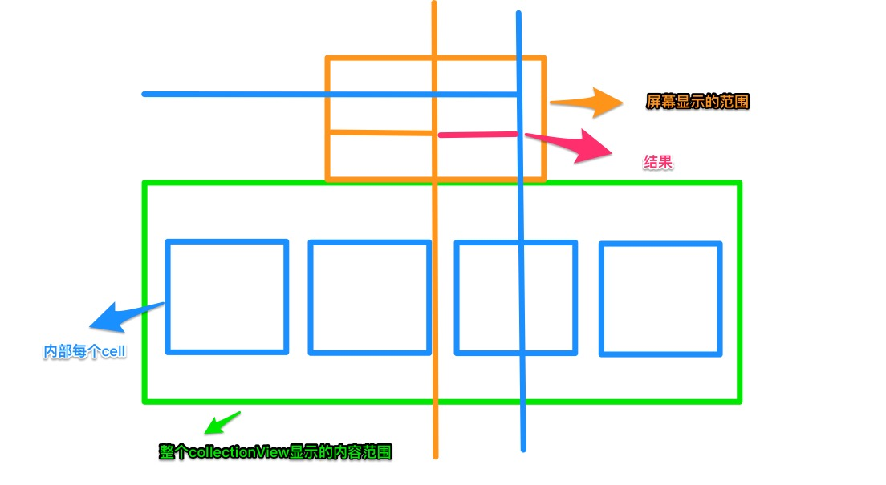

# 制作iOS的图片浏览器

使用collectionView可以做出相片浏览器，但是想要滚动时候又缩放效果，同时滚动时候能自动让图片显示在中间，这样就需要对flowlayout进行定制。

collectionView的系统的流水布局已经可以满足日常需要，但是如果你需要给滚动的时候加上动画，还是需要自定义流水布局。

## 如何自定义流水布局

### 1.需要重写的方法

自定义流水布局只需要新建一个类，继承自UICollectionViewFlowLayout，然后重写它的系统方法。

和定制图片浏览器效果有关的5个系统方法：

1. `- (void)prepareLayout;` 这个方法是在collectionView第一次显示或者刷新的时候会调用，默认这个方法是不做任何事情的，子类可以重写它来进行数据结构的设置或者计算任何需要执行的布局后的初始计算。

2. `- (CGSize)collectionViewContentSize;`这个方法是用来计算collectionView的滚动范围，可以重写，也可以不重写。

3. `- (nullable NSArray<__kindof UICollectionViewLayoutAttributes *> *)layoutAttributesForElementsInRect:(CGRect)rect;`

4. `- (BOOL)shouldInvalidateLayoutForBoundsChange:(CGRect)newBounds; `这个方法意思是在滚动时候是否可以重新布局，默认是NO，如果想要滚动时候产生缩放效果则必须设置为yes，**这里invalidate意思是刷新。**

5. `- (CGPoint)targetContentOffsetForProposedContentOffset:(CGPoint)proposedContentOffset withScrollingVelocity:(CGPoint)velocity;`这个方法是获得最终滚动的位置，因为在滚动时候有一个速率，苹果内部根据速率来计算缓冲，因此你快速滑动，会向后缓冲一段距离。

## 2.开始实现滚动时候缩放效果

### 2.1 实现滚动时候可以设置布局

```obj-c
- (BOOL)shouldInvalidateLayoutForBoundsChange:(CGRect)newBounds
{
	return YES;
}
```

### 2.2 在滚动的过程中对图片进行缩放

离屏幕中心点越近的图片越大，离中心点越远的图片越小，这边只需要拿到具体的cell改变他的`transform`属性就可以。具体如何实现呢,需要以下的思路：

* 先确定一个`rect`来获得这个rect的cell，rect的宽度和高度不用说肯定是collectionView的宽度和高度，但是坐标点是在变换的，因为collectionView会滚动，但是通过深入学习`bounds`我们可以知道滚动底层实现就是改变bounds，**因此滚动时候设置的frame直接取collectionView的bounds就可以了**。
* 拿到给定的范围的cell，这时候我们需要计算cell的缩放的大小，越靠近屏幕中间的则越大，离的越远则越小，为了设置动态缩放，我们需要计算cell中心点离屏幕中心点的位置，然后计算比例，在中心点就是正常尺寸，有偏移的就缩小一定程度。

通过上面这个图我们可以直观的理解，屏幕显示的范围在不停的变化，但是每次变化基本上都会包含2个cell，通过计算cell离中心点的距离，具体的计算就是cell的中心点横坐标减去collectionView的偏移的x，减去collectionView一半宽度就能够得到偏移量(**要取绝对值，因为可能是负的**)。
* 然后计算百分比，这里得到的偏移量是cell的中心点离collectionView中心点距离，因此与collectionView的宽度一半进行相除，如果是0，则意味着2个中心点重合，这时候的缩放比例应该是最大的，如果为1则是最小，是负相关，因此用1来减去得到正相关，这样当在中心点位置就是1，距离最远就是0.但我们也不希望离中心点位置远的缩小为0，比中心点的小一部分尺寸就可以了，所以`cellOffset / (self.collectionView.frame.size.width * 0.5) * 0.3`这样离中心点距离为半个collectionView宽度的cell尺寸缩小0.7

```obj-c
- (nullable NSArray<__kindof UICollectionViewLayoutAttributes *> *)layoutAttributesForElementsInRect:(CGRect)rect
{
    // ----1.先获取当前collectionView所在区域的cell
    NSArray *attrs = [super layoutAttributesForElementsInRect:self.collectionView.bounds];
    
    for (UICollectionViewLayoutAttributes *cellAttr in attrs) {
        
        // ----获取偏移量（取绝对值）
        CGFloat cellOffset = fabs(cellAttr.center.x - self.collectionView.contentOffset.x - self.collectionView.frame.size.width * 0.5);
        
        // ----计算百分比
        CGFloat perCent = 1 - cellOffset / (self.collectionView.frame.size.width * 0.5) * 0.3;
        
        cellAttr.transform = CGAffineTransformMakeScale(perCent, perCent);
    }
```

### 2.3 设置滚动结束的停留位置

在滚动之后，最好的用户体验是自动停留在距离中心点最近的图片显示在中间，这样就需要用到了`- (CGPoint)targetContentOffsetForProposedContentOffset:(CGPoint)proposedContentOffset withScrollingVelocity:(CGPoint)velocity`这个方法，我们来分析下如何处理：

* 因为我们知道有个缓冲，所以手指滑动时候，collectionView的偏移量和最终停留位置的坐标点不一致，这个方法返回的就是最终停留的坐标点，因此可以先调用super的这个方法，获得到最终停留点。
* 根据最终的滚动停止的坐标，就可以得出最后滚动停止之后的区域，然后拿到该区域的cell**这里要调用super的方法，因为我们已经重写了当前类的这个方法**；
* 计算cell谁离中心点最近，然后把该cell设置为屏幕中心,因此要取出最小的的距离点。**这里比较值的时候可能会有负的，因此要去绝对值**
* 然后用最终的偏移量加上这个距离中心点的距离，这样可以设置距离最近的图片显示在中信。**通过打印发现可能会出现-0这种情况，导致卡顿，需要做个判断**

```obj-c
- (CGPoint)targetContentOffsetForProposedContentOffset:(CGPoint)proposedContentOffset withScrollingVelocity:(CGPoint)velocity
{
    CGPoint targetP = [super targetContentOffsetForProposedContentOffset:proposedContentOffset withScrollingVelocity:velocity];
    
    CGFloat collectionW = self.collectionView.frame.size.width;
    
    CGFloat collectionH = self.collectionView.frame.size.height;
    
    CGRect frame    = CGRectMake(targetP.x, 0, collectionW, collectionH);
    
    NSArray *attrs  = [super layoutAttributesForElementsInRect:frame];
   
    CGFloat minOffSetX = MAXFLOAT;
    
    for (UICollectionViewLayoutAttributes *attr in attrs) {
        
        // ----这里要减去最终偏移量的x！！！
        CGFloat cellOffset = attr.center.x - targetP.x - collectionW * 0.5;
        
        if (fabs(cellOffset) < fabs(minOffSetX)) {
            minOffSetX = cellOffset;
        }
    }
    
    targetP.x += minOffSetX;
    
    // ----拖动时候可能会卡顿，通过打印发现有负0，这种情况，因此做个判断
    if (targetP.x < 0) {
        targetP.x = 0;
    }
    
    return targetP;
}
```


